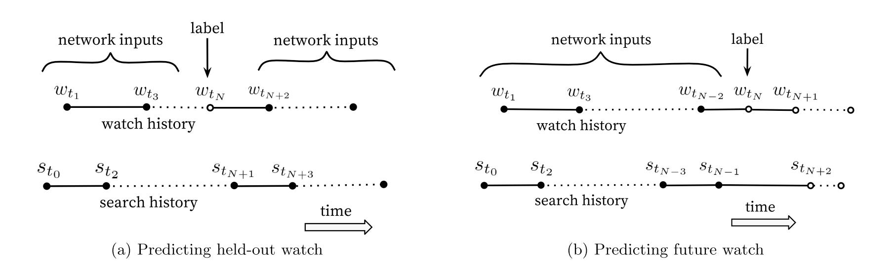

My notes and summary on paper [Deep Neural Networks for YouTube Recommendations](https://static.googleusercontent.com/media/research.google.com/en//pubs/archive/45530.pdf).

This is a concise paper packed with rich details! Also one of the best papers I've ever read!

## Introduction
Why recommending YouTube videos is hard
* Scale. over a billion users and millions of videos
* Freshness. very dynamic, lots of newly uploaded videos and user latest actions.
* Noise. users feedback are noisy, metadata poorly structured.

## System Overview
Two stage approach: retrieval (candidate generation) and ranking.

Retrieval (typically Two-Tower DNN)
* Inputs: **coarse features** of user history, context, and videos
* Output: 100-1000 candidate videos
* fast and scalable with massive data, using collaborative filtering
* Targeting high recall

Ranking
* Inputs: candidates generated from retrieval + other sources, **rich feature set** about videos and users
* Output: a highly personalized ranking list
* Targeting high precision

Rely on A/B testing via live experiments, measuring changes in CTR (Click-Through Rate), watch time, and many other metrics that measure user engagement.
Live A/B results are not always correlated with offline experiments. (??)

## Candidate Generation

### Recommendation Modeled as Classification problem

### Model architecture and Training
Model architecture is depicted in Figure 3 in the paper, similar idea as [word2vec](https://arxiv.org/abs/1301.3781). 

Before training, a DNN model and video embedding matrix $W \in R^{|V| \times d}$ are initialized, where $|V|$ is the video corpus size, and d is embedding dimension like 256.

Each training example corresponds to a watch record of a user. The inputs to DNN include user history and context, i.e., watch history, search history, demographics, example age, gender etc.

Output of the last ReLU, before the softmax layer, is the user embedding $u \in R^d$. We compute softmax between the user embedding $u$ and each video $v \in R^d$, $\frac{e^{v_iu}}{\sum_{j \in V}e^{v_ju}}$. The watched video is the positive class for the softmax classifier.

Gradients are back propagated to update the DNN and video embedding matrix $W$.

At serving time, we run through the DNN to get a user embedding, and the scoring problem reduces to a nearest neighbor search problem.

#### Training label
use implicit feedback of watches to train the model, where a user completing a video is a positive example.

This choice is based on the **orders of magnitude more implicit user history** available, allowing us to produce recommendations **deep in the tail** where **explicit feedback is extremely sparse**.

#### Negative Sampling + Importance sampling
Computing the full softmax over the entire video corpus $V$ is expensive. The paper:

* sample negative samples (several thousands) from a "background distribution" (e.g., item popularity)
* compute softmax over the one positive item (user watched video) and negative samples
* correct probability using importance sampling

🤔 In tensorflow, I think we can use `tf.nn.sampled_softmax_loss` to compute the sampled cross entropy loss. 

At serving, the paper says A/B results were not particularly sensitive to the choice of nearest neighbor search algorithm. (🤔There are a number of choices to choose, like ScaNN, Faiss, etc.)

### Features
Use various features:
* search history is treated in the same way as short text, tokenize + embedding + average like `GlobalAveragePooling1D` to generate a dense vector for each query
* Demographic features are important to new users
* User's geographic region and device
* booleans and continuous features are treated like numbers and normalized

#### Example Age (Not Video Age!)
The distribution of video popularity is **high non-stationary** but the trained multinomial distribution will reflect the average watch likelihood in the training window of several weeks. To correct this, **we feed the video age of the training examples as a feature during training. At serving time, this feature is set to zero (or slightly negative) to reflect that the model is making predictions at the very end of the training window**.  :boom:

🤔 I think the example_age is not about boosting new videos. It’s about modeling the non-stationary distribution of user behavior over time during training. Note here:

`example_age = training_time - watch_time`

`video_age = watch_time - video_upload_time`

The key point is that the distribution the model trained to learn is non-stationary, and therefore we feed in `example_age` to tell the model to down-weight older training examples.

At serving time, the model pretends all videos are “brand new” by setting `example_age = 0` or slightly negative — for **all** videos. We treat all candidate videos, regardless of upload time, as if they were just uploaded now, to simulate a “present-moment” popularity context.

### Label (Training example) and Context Selection

🤔 This section is about selecting training examples and constructing the context.

Training examples selection:
* generate from ALL youtube watches, not just watches on the produced recommendations
* generate a fixed number of training examples per user, to prevent a small group of highly active users from dominating the loss

Constructing the context: :boom:
* Natural consumption patterns of videos typically lead to **very asymmetric co-watch probabilities**. 
* We therefore found **much better performance predicting the user's next watch, rather than predicting a randomly held-out watch**. 
* Held-out watch prediction **leaks future information** and ignore any asymmetric consumption patterns (🤔 when we predict the next watch, we don't know the future. somehow like GPT vs BERT.)

(b) works better than (a) in the figure above.

### Experiments with Features and Depth

🤔 Regarding features, I understand each video ID or search token is embedded into a 256-dimensional vector. The bag size is 50. It means:
* Up to 50 video IDs → each embedded into 256-d → results in a [50 x 256] tensor.
* According to Figure 3, the [50 x 256] tensor is converted into a 256-dimensional vector via average pooling, like passing through `keras.layers.GlobalAveragePooling1D`. (There are other pooling methods of course. )
* For a user who doesn't have 50 recent videos, we can create a padding mask for example.

And search queries are preprocessed in the same way.

Network structure followed a common "tower" pattern in which **the bottom of the network is widest and each successive hidden layers halves the number of units**. Width and depth were added until the incremental benefit diminished and convergence became difficult.

| Depth   | Description                                                   |
|---------|---------------------------------------------------------------|
| Depth 0 | Logistic regression. Directly connects features to the output |
| Depth 1 | One hidden layer with 256 units                               |
| Depth 2 | 2 hidden layers, 512 -> 256.                                  |
| Depth 3 | 3 hidden layers, 1024 -> 512 -> 256.                          |
| Depth 4 | 4 hidden layers, 2048 -> 1024 -> 512 -> 256.                  |

We can see the output is always 256 dimensional.

All features combined with the deepest structure has the best performance.

## Ranking

### Modeling Expected Watch Time

🤔 The paper uses weighted logistic regression.

$L = -w \cdot \left[ y \log(\hat{p}) + (1 - y)\log(1 - \hat{p}) \right]$

where:
* $w = T$ the watch time $T$ when $y = 1$, and $w = 1$ when $y = 0$.
* $\hat{p} = \frac{1}{1 + e^{-x}}$ where $x$ is the log odds of click, raw logits output of the last linear layer

Let $p$ be the probability of being watched (clicked), by definition odds = $\frac{p}{1-p}$, so the learned odds by the model is $\frac{\sum T_i}{N-k}$ where N is the total number of impressions in the training dataset, and $k$ is the total number of watched impressions.

When $p = k/N$ is small, $\frac{p}{1-p} \approx p + p^2$ (the first two items of taylor series), 

$\frac{\sum T_i}{N-k} = \frac{E[T] \cdot k}{N-k} \approx E\[T\](1+p) \approx E[T]$.

🤔 Weighted logistic regression vs MSE loss:
* Weighted logistic regression models both click rate and watch time
* MSE only models the watch time
* We care more about **ranking** than exact prediction so a classification is better

