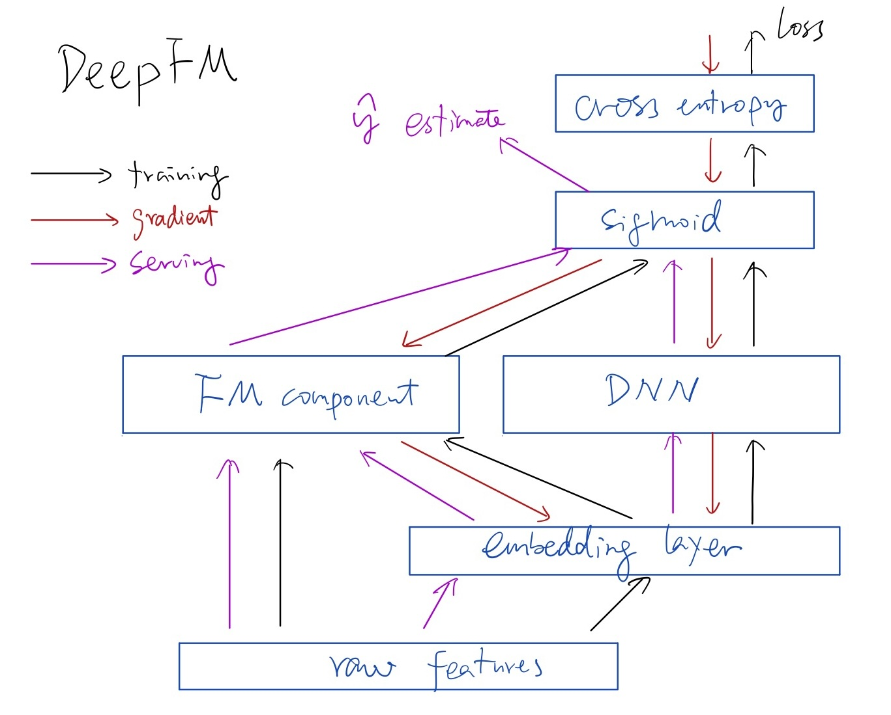

Paper
* [Factorization Machines](https://www.ismll.uni-hildesheim.de/pub/pdfs/Rendle2010FM.pdf)
* [DeepFM: A Factorization-Machine based Neural Network for CTR Prediction](https://arxiv.org/abs/1703.04247)

## Factorization Machine

This paper deals with problems where feature vector $x \in R^n$ is highly sparse, i.e. almost all the elements $x_i \in R$ are zeros. Huge sparsity appears in many real-world data like feature vectors of event transactions (e.g. purchases in recommender systems) or text analysis (e.g. bag of word approach). One reason for huge sparsity is that the underlying problem deals with large categorical variable domains.

### Factorization Machine Model
The model equation for a factorization machine of degree $d=2$ is defined as:

$\displaystyle \hat{y}(x) = w_0 + \sum_{i=1}^n w_ix_i + \sum_{i=1}^n\sum_{j=i+1}^n<v_i, v_j>x_ix_j$

where:
* $w_0 \in R$ is the bias
* $w \in R^n$, $w_i \in R$
* $V \in R^{n \times k}$ and $v_i \in R^k$ where $k$ is a hyperparameter (embedding dimension)

**$<v_i, v_j>$ models the interaction between i-th and j-th features. Instead of using an own model parameter $w_{i,j} \in R$ for each interaction, the FM models the interaction by factorizing it**.

🤔 In traditional models, the interactions between $x_i$ and $x_j$ may be captured as $w_{i,j}x_ix_j$. There is a **quadratic growth of parameters**. And there may not be enough many pairs $x_i$ and $x_j$ in the training set, leading to **overfitting**. Further, there is no **generalization** here. By learning a latent vector for each feature, we have generalization and linear growth of parameters ($k$ is a constant.)

To avoid computing all $\binom{n}{2}$ pairs explicitly, FM uses this trick:  
  
$\displaystyle \sum_{i=1}^n\sum_{j=i+1}^n<v_i, v_j>x_ix_j = \frac{1}{2} \left( \left( \sum_{i=1}^{n} v_i x_i \right)^2 - \sum_{i=1}^{n} v_i^2 x_i^2 \right)$  
  
This lets we compute the entire second-order term in **linear time** with respect to feature dimension $n$, making it scalable.

### About Factorization and $k$

🤔 The pairwise interaction matrix $W \in R^{n \times n}$ (where $n$ is the number of features) is positive definite. We know it has a Cholesky decomposition $W = VV^T$, where $V \in R^{n \times n}$ is a lower triangular matrix. If we want to have an approximation, the dimension $k$ of $v_i$ must be large enough.

The paper says, in the sparse settings, **typically a small $k$ should be chosen because there is not enough data to estimate complex interactions $W$**. Restricting $k$ leads to better generalization thus improved interaction matrices under sparsity.

## DeepFM for CTR Prediction
DeepFM consists of two components, with a shared embedding layer trained jointly.

### FM component
The FM component is a 2-way factorization machine, aiming to learn linear (order-1) features and order-2 feature interactions.

In previous approach, the parameter of an interaction between feature $i$ and $j$ can be trained only when they are both in the same data record. While in FM, the interaction is measured via the dot product of their corresponding latent vector $V_i$ and $V_j$. With latent vectors, FM can learn $V_i$ or $V_j$ whenever feature $i$ or $j$ is present.

$\displaystyle y_{FM}=<w, x> + \sum_{j_1=1}^d\sum_{j_2=j_1 +1}^d <V_i, V_j>x_{j_1}\cdot x_{j_2}$

where
* $y$ is click prediction, $y=1$ means ad is clicked otherwise $y=0$.
* $x$ represents high-dimensional and extremely sparse raw features
* $<a, b>$ means dot product between $a$ and $b$.
* $w$ is weights of the linear layer
* $V_i$ and $V_j$ are dense, low-dimensional embeddings (latent vectors) of feature $i$ and $j$ respectively

The first part $<w, x>$ is to learn order-1 features, and second part order-2 feature interactions.

### Deep Component
The deep component is a feed-forward neural network, which is used to learn high-order feature interactions.

Different from previous works, here **the embedding layer is shared by both FM and deep components and trained jointly**. The paper says this architecture has two benefits:
* it learns both low and high order feature interactions from raw features
* there is **no need for expertise feature engineering** of the input.

